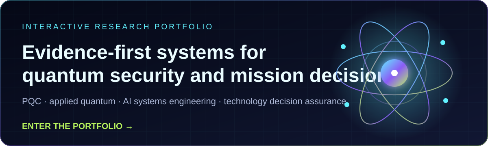

# Ray Beecham

**Quantum Security · Crypto-Agility · Applied Quantum Systems · Technology Decision Assurance**

U.S. Navy Veteran · Federal Cybersecurity · Post-Quantum Cryptography · Cloud & DevSecOps

  

  <strong><a href="https://raybeecham.github.io/raybeecham/">Enter the interactive research portfolio →</a></strong>

I build evidence-driven systems for **post-quantum migration, cryptographic discovery, transport visibility, quantum workload evaluation, and emerging-technology decision assurance**.

My current work is centered on a practical question:

> How do we turn complex technical evidence into a decision that is explainable, reproducible, appropriately bounded, and useful to a real mission owner?

That means preserving what was observed, what was inferred, what remains unknown, which rules produced a result, and what still requires accountable human judgment.

## Current Research Programs

| Program | What I am building |
|---|---|
| **Technology Decision Assurance Framework (TDAF)** | A mission-first, deterministic framework for evaluating whether an emerging technology should be considered for a specific problem. It separates the mission problem, evidence, rulebook, computed result, decision record, and organizational decision. Quantum suitability is the first technology module. |
| **PQC and Crypto-Agility Engineering** | Practical methods for cryptographic inventory, CBOM-style reporting, TLS 1.3 and HTTP/3 visibility, hybrid ML-KEM testing, harvest-now-decrypt-later risk analysis, certificate agility, and phased migration planning. |
| **Applied Quantum Systems** | Hardware-aware benchmarking, quantum-kernel evaluation, QUBO and Hamiltonian optimization, grid-resilience planning, fraud-detection experiments, and workload-to-platform suitability analysis. |
| **Research and AI Systems Engineering** | Evidence pipelines, strategic signal tracking, temporal intelligence, testable forecasts, governed agent workflows, output evaluation, and reusable engineering playbooks. |

## Featured Public Projects

| Project | Purpose |
|---|---|
| **[Quantum Research Scout](https://github.com/raybeecham/quantum-research-scout)** · [Live dashboard](https://raybeecham.github.io/quantum-research-scout/) | Evidence-first intelligence for quantum technology, PQC, federal missions, procurement, patents, organizations, and strategic forecasts. The system preserves provenance, labels inference, quarantines weak evidence, and publishes daily, weekly, and monthly intelligence. |
| **[Quantum Oncology Benchmark](https://github.com/raybeecham/quantum-oncology-benchmark)** | A reproducible framework for comparing strong classical baselines with quantum-kernel methods on oncology research tasks. It emphasizes leakage prevention, shared partitions, confidence intervals, pairwise provenance, resource accounting, and explicit limits on quantum-advantage claims. |
| **[PQC Readiness War Room](https://github.com/raybeecham/pqc-readiness-war-room)** · [Live demo](https://pqc-readiness-war-room.raybeecham2009.workers.dev/) | A Cloudflare Worker that explains observable TLS modernization and HTTPS posture while keeping ML-KEM support, crypto discovery, vendor readiness, and enterprise migration readiness explicitly unverified until evidence exists. |
| **[Crypto Inventory Demo](https://github.com/raybeecham/crypto-inventory-demo)** | A CodeQL-based cryptographic discovery pipeline for Java, Python, TLS configuration, and runtime observations. It produces a normalized inventory, risk summary, and CI enforcement for critical cryptographic findings. |
| **[Claude Foundations and AI Systems Engineering Handbook](https://github.com/raybeecham/claude-certified-associate-foundations)** | Scenario-based certification preparation combined with a vendor-neutral method for designing reliable, secure, evaluated, and human-governed AI workflows. |
| **[Modern Practical PKI](https://github.com/raybeecham/modern-practical-pki)** | An incremental Docker-based OpenSSL lab that moves from encoding, hashing, ASN.1, and key generation toward certificate authorities, certificates, revocation, TLS, HSMs, and broader PKI operations. |
| **[Chrono](https://github.com/raybeecham/Chrono)** | An AI-powered historical simulation built during OpenAI Build Week, featuring a reconstructed 1998 desktop, period-aware dialogue, structured temporal-contamination detection, and a deterministic offline fallback. |

## Additional Active R&D

Some work is still private or being prepared for a future public release:

- A local defensive lab that measures classical and hybrid post-quantum TLS handshakes, records only observed negotiation data, and produces transparent HNDL risk and migration outputs.
- A hardware-architecture assessment method covering circuit fidelity, routing behavior, error provenance, fault-tolerance readiness, and cryptographic resource projections.
- Hybrid quantum-classical optimization pipelines for federal energy-resilience exercises and highly imbalanced fraud-detection workloads.
- An emerging vendor-neutral quantum workload advisor for deciding whether a controlled experiment is justified before comparing providers.

## Engineering Principles

- **Evidence before claims:** Source provenance, limitations, conflicts, and unknowns remain visible.
- **Mission before technology:** Start with the problem and decision context, not a preferred platform or vendor.
- **Classical baselines before quantum conclusions:** Quantum results are compared against credible classical methods under shared evaluation conditions.
- **Reproducibility by default:** Versioned configurations, schemas, deterministic outputs, CI, tests, and machine-readable artifacts are part of the design.
- **Human accountability:** A model, score, benchmark, or framework result supports a decision. It does not authorize procurement, deployment, clinical action, or operational control.
- **Security boundaries matter:** Tools fail closed, protect credentials, avoid unauthorized scanning, and distinguish lab evidence from production assurance.

## Technical Stack

| Area | Tools and methods |
|---|---|
| **Security and Cryptography** | PQC, ML-KEM, TLS 1.3, HTTP/3 and QUIC, PKI, OpenSSL, CodeQL, CBOM concepts, Wireshark, tshark, cryptographic inventory, Zero Trust |
| **Software and Automation** | Python, TypeScript and JavaScript, FastAPI, Streamlit, Next.js, Cloudflare Workers, Docker, GitHub Actions, SQLite, REST APIs, JSON Schema |
| **Quantum and Optimization** | Qiskit, Qrisp, D-Wave Ocean, quantum kernels, QUBO, Hamiltonian optimization, circuit benchmarking, hardware-aware compilation and routing analysis |
| **Data and AI** | pandas, NumPy, scikit-learn, statistical evaluation, provenance tracking, structured outputs, agent workflows, retrieval and evidence pipelines |
| **Cloud and Federal Strategy** | AWS, cloud security, DevSecOps, NIST and FIPS alignment, federal modernization, mission assurance, technology evaluation, acquisition-support analysis |

## Credentials and Education

**Selected credentials:** GIAC Certified Intrusion Analyst (GCIA), AWS Certified Solutions Architect - Associate, ISC2 Systems Security Certified Practitioner (SSCP), CompTIA Security+, Q-CTRL Quantum Professional, SandboxAQ AQtive Guard Certified Practitioner, and D-Wave Quantum Programming - Core.

**Education:** M.S. in Information Systems with a cybersecurity concentration from Texas A&M University-Central Texas, and B.B.A. in Computer Information Systems from Texas State University.

## Connect

- [Interactive research portfolio](https://raybeecham.github.io/raybeecham/)
- [LinkedIn](https://linkedin.com/in/RaymondBeecham)
- [GitHub](https://github.com/raybeecham)

---

These are personal research and open-source projects. Views are my own. Project outputs are decision support and research artifacts, not employer or client positions, procurement authorization, medical advice, or operational approval.
